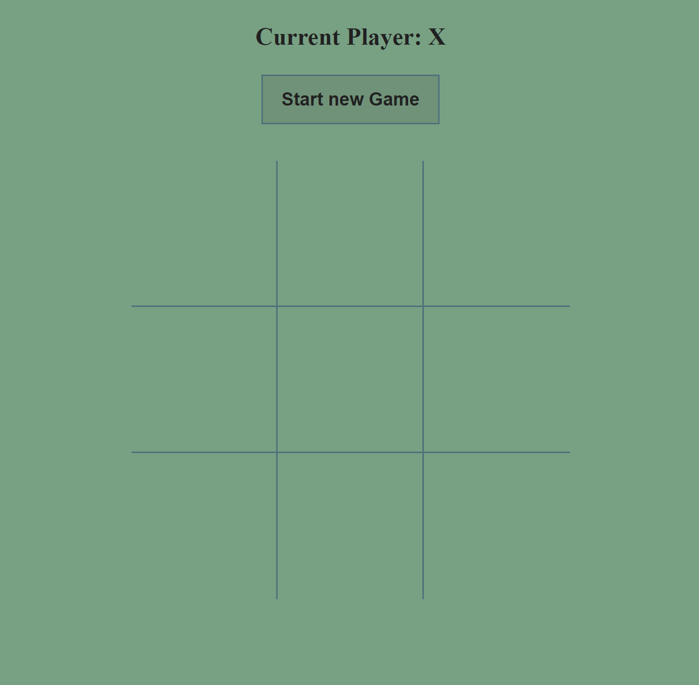
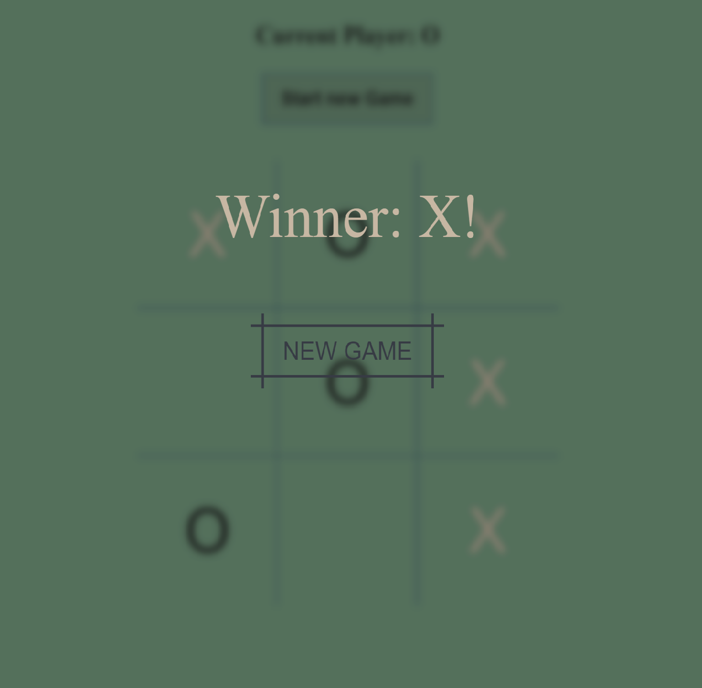
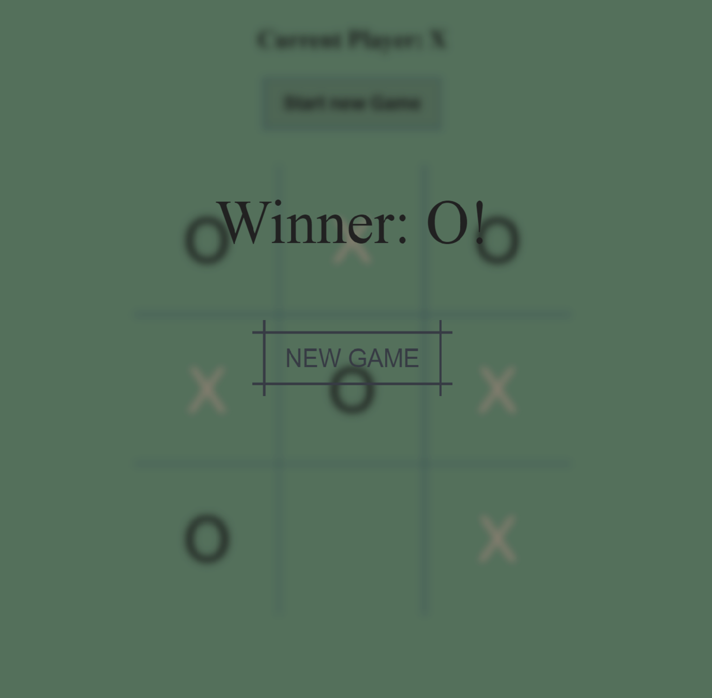

# Tic Tac Toe Game

Tic Tac Toe is a two-player game in which the objective is to take turns and mark the correct spaces in a 3x3 grid. Think on your feet but also be careful, as the first player who places three of their marks in a horizontal, vertical or diagonal row wins the game!

## Technologies used

The Tic Tac Toe Angular web app was built using the following technologies:

- Angular: web app build
- TypeScript: web app's logic
- CSS: plain CSS for styling

## Deployment

[Tic Tac Toe Angular Game](https://stanimir-p.github.io/Tic-Tac-Toe-Angular/)